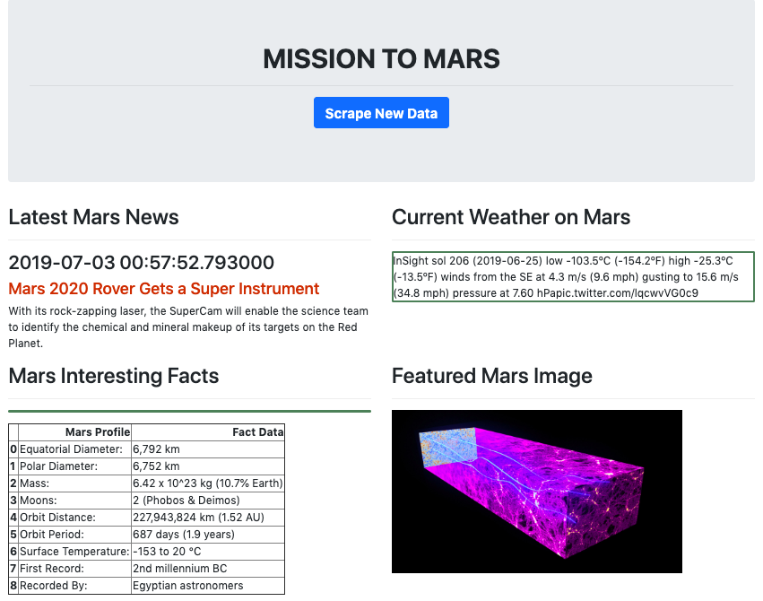
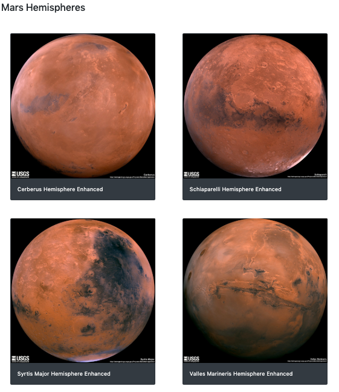

## Web Scraping
Web scraping on Mars Info from:  
NASA,  
Tweeter,  
Space-Facts.com and  
USGS Astrogeology websites  
using Pandas and Beautiful Soup

 
Mars Information Scraping  
  

Mars Hemisphere Photos  
 

